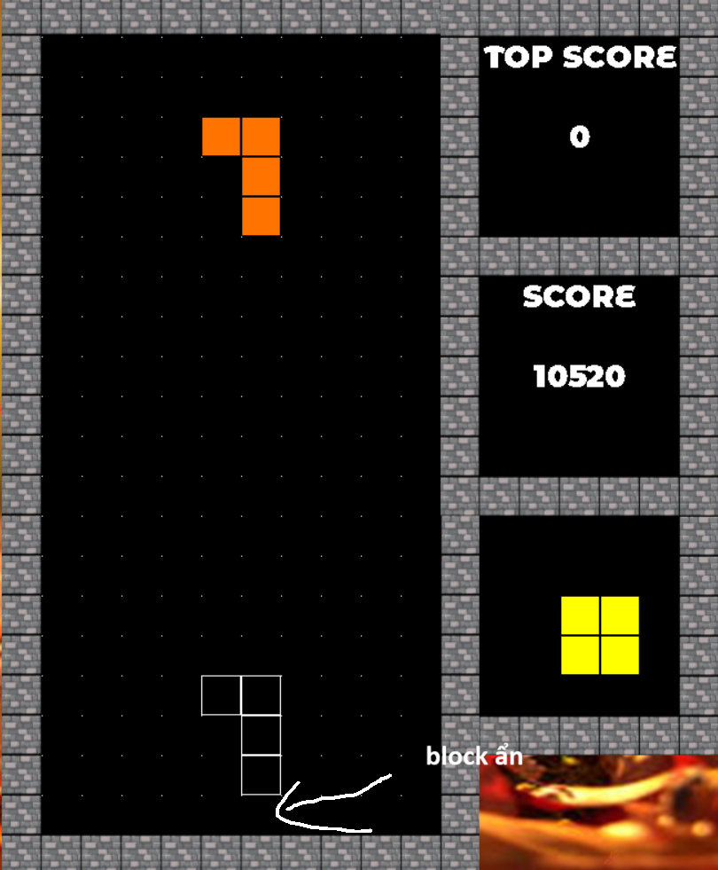

# **SDL2-TETRIS-GAME-INT2215-51**
# NGUYỄN QUANG HUY 23020081

Link demo: [Demo](https://www.youtube.com/watch?v=7cCyuuW7rZk)

- [**SDL2-TETRIS-GAME-INT2215-51**](#sdl2-tetris-game-int2215-51)
- [NGUYỄN QUANG HUY 23020081](#nguyễn-quang-huy-23020081)
- [Mô tả chung](#mô-tả-chung)
  - [Tổng quan](#tổng-quan)
  - [Cách chơi](#cách-chơi)
- [Các tính năng](#các-tính-năng)
  - [1. MENU](#1-menu)
  - [2. SINGLE PLAYER](#2-single-player)
  - [3. BATTLE](#3-battle)
  - [4. VS COMPUTER](#4-vs-computer)
  - [5. UPSIDE DOWN](#5-upside-down)
  - [6. MIND BENDER](#6-mind-bender)
  - [7. INVISIBLE](#7-invisible)
  - [5. SETTING](#5-setting)
    - [5.1 LEVEL](#51-level)
    - [5.2 GHOST TETROMINO](#52-ghost-tetromino)
    - [5.3 THEME](#53-theme)
    - [5.4 EFFECT](#54-effect)
    - [5.5 VOLUME](#55-volume)
    - [5.6 MODE](#56-mode)
  - [6. LƯU GAME](#6-lưu-game)
  - [7. ABOUT](#7-about)
- [TỔNG KẾT](#tổng-kết)

# Mô tả chung
## Tổng quan
- Tetris hay xếp hình tạo ra ngày 06/06/1984 tại Moskva. Số thứ 100 của tạp chí Electronic Gaming Monthly gọi Tetris là "Trò chơi Vĩ đại nhất trong Mọi thời đại". Nó đã bán được hơn 70 triệu phiên bản.
- Trò chơi có bảy loại khối hình: I (thẳng đứng), J, L, O (vuông), S, T, Z. Ta thấy mỗi khối gạch được cấu tạo từ 4 hình vuông nhỏ xếp lại với nhau.

- Các hình khác được tạo ra khi xoay các khối cơ bản này các góc tương ứng 90 độ, 180 độ, 270 độ.

## Cách chơi
- Mục tiêu của trò chơi là di chuyển các khối gạch đang rơi từ từ xuống trong kích thước hình chữ nhật 20 hàng x 10 cột (trên màn hình). Chỗ nào có gạch rồi thì không di chuyển được tới vị trí đó. Người chơi xếp những khối hình sao cho khối hình lấp đầy 1 hàng ngang để ghi điểm và hàng ngang ấy sẽ biến mất.
- Sử dụng a,s,d hay các phím mũi tên phải, xuống, trái để di chuyển, phím w hay phím mũi tên lên dùng để quay tetromino. Phím space và enter dùng để thả tetromino xuống ngay lập tức.

# Các tính năng
## 1. MENU

- Menu mang đến cho người chơi các 4 chức năng khác là single play, vs human, vs computer và setting. Vói hiệu lá và tuyết rơi bay bay mang đến cho người chơi trải nghiệm như xem phim 3D

## 2. SINGLE PLAYER

- Các thanh Top score, score lưu điểm người chơi
- Cơ chế tính điểm: độ khó càng cao, ăn được càng nhiều hàng cùng 1 lúc thì tăng càng nhanh.
- Next tetromino cho phép người chơi tính toán sao cho hợp lí.
- Các tetromino được sinh ra ngẫu nhiên
- Người chơi nhấn P để pause (tùy với mỗi theme sẽ có pause khác nhau)

- Tại bảng pause người chơi có thể chọn chơi tiếp, chơi lại hoặc quay về menu.
- Khi thua game sẽ hiện ra 1 bảng để người chơi lựa chọn quay về menu hay chơi lại.

## 3. BATTLE
- Cho phép hai người chơi chơi cùng 1 lúc, mang đến những trận battle nóng bỏng, gay cấn đến từng phút giây.
- Các tính năng khác có tương tự như trong single play.

## 4. VS COMPUTER 
 
- Nếu như không có ai chơi cùng, bạn hoàn toàn có thể chọn chế độ đấu với máy để so tài (đừng coi thường máy nhé).
- Sử dụng các giá trị kì vọng và expected value để tìm vị trí và trạng thái tốt nhất khi rơi, bot có thể dễ dàng chiến thắng 1 người chơi không chuyên với số điểm có thể lên đến 26000 điểm.

## 5. UPSIDE DOWN
- Người chơi sẽ được trải nghiệm cảm giác chơi ở thế giới ngược và sẽ mất một thời gian để làm quen.

## 6. MIND BENDER
- Như cái tên, người chơi sẽ được trải nghiệm những cảm giác bối rối khi xuất hiện các hộp bí ẩn.

Hộp bí ẩn có tất cả 6 loại:
- Speed up: các tetromino sẽ rơi nhanh hơn trong 5s.
- Slow down: các Tetromino sẽ rơi chậm hơn trong 5s.
- Erosion: một số block ngẫu nhiên sẽ biến mất.
- Twist: các block bên trái sẽ đổi chỗ cho block bên phải.
- Fission: các block sẽ tạt sang 2 bên.
- Turn: các block sẽ lộn ngược từ dưới lên.

## 7. INVISIBLE
- Để chơi chế độ tàng hình, bạn cần cài đặt level khó nhất (ultra hard).
- Chế độ chơi tàng hình giúp bạn rèn luyện trí nhớ. Tuy nhiên, để giảm độ khó, game sẽ tàng hình trong 3s và bật trong 3s xen kẽ.

## 5. SETTING
### 5.1 LEVEL
- Giúp bạn điều chỉnh level tùy với khả năng chơi của mình, level càng cao tetromino rơi càng nhanh
- Khi đạt được 1 số điểm nhất định, game sẽ tự động tăng level.

### 5.2 GHOST TETROMINO
- Người chơi có thể bật tắt ghost tetromino tùy sở thích và phong cách chơi của mình.

### 5.3 THEME
- Game mang đến 2 theme cho người chơi: phong cảnh tuyết rơi mùa đông và lá thu bay bay hữu tình.

### 5.4 EFFECT
- Hiệu ứng khi 1 hay nhiều hàng được xóa
- Chọn None để không sử dụng
- Chọn Capcut để có hiệu ứng giật giật
- Chọn Fade để có hiệu ứng biến mất dần dần

### 5.5 VOLUME

- Thay vì chỉnh volume truyền thống một cách nhàm chán, giờ đây người chơi có thể chỉnh volume bằng cách bắn đại bác, bắn càng xa thì volume càng to và ngược lại

### 5.6 MODE
- Chọn các chế độ chơi Normal, Upside down hay Mind bender

## 6. LƯU GAME
- Khi thoát game bằng cách nhấn phím X, game sẽ được lưu lại từ cách setting đến ván game đang chơi dở giúp người chơi có thể nghỉ ngơi trong mỗi ván đấu.

## 7. ABOUT
- Click vào chữ About ở dưới góc trái màn hình để đưa người chơi đến github, giúp người chơi hiểu rõ về game hơn

# TỔNG KẾT
Với nền tảng học SDL2 từ lazyfoo, game do em tự viết hoàn toàn 100% và không copy 1 dòng code nào.

Việc hoàn thiện 1 dự án lập trình như thế này giúp em mở mang kiến thức rất nhiều.
- Sử dụng thành thạo class, pointer, chia tách file,...
- Cách dùng github.
- Cách viết file readme đơn giản
- Học rất nhiều syntax, thuật toán mới của c++.
- Có cái nhìn tổng quát về lập trình hướng đối tượng
- Hình thành tư duy xử lý và giải quyết bài toán và fix bug (rất nhiều bug).
- Học cách refactor code (học tập từ lazyfoo).

Bên cạnh đó, em xin cảm ơn bạn Nguyễn Lê Minh đã mang đến ý tưởng về thuật toán chạy con tetris bot. Em xin chân thành cảm ơn thầy đã góp ý về hiệu ứng thêm đối với game. 

Với rất nhiều tính năng để chơi đa dạng như 
- Thế giới ngược, hộp bí ẩn
- Các mức độ khó từ dễ đến tàng hình
- Hiệu ứng đồ họa xuất hiện từ background đến trong khi chơi
- Các tính năng tạm dừng, tiếp tục, chơi lại, quay về menu một cách mượt mà
- Hiệu ứng âm thanh xuất hiện liên tục và có thể điều chỉnh bằng cách bắn đại bác một cách sáng tạo
- Theme thay đổi 2 mùa và bảng pause thay đổi theo theme
- About và save file
- 1 con bot tương đối khôn
- Code tương đối clean với comment đầy đủ (mặc dù tiếng anh của em còn hạn chế)

Em mong muốn mình có thể đạt được điểm 10 với game này.

 

